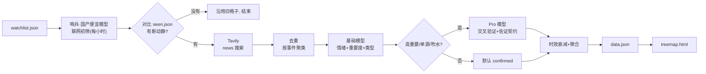

# M3 · 后端轮子(Tavily + 双模型 + Actions)

<aside>
🛞

可直接丢进 GitHub repo 跑的 v1 后端。闭环:**watchlist.json → Tavily 搜索 → 去重 → 基础模型打分 → Pro 模型交叉验证 → 时效衰减聚合 → data.json → treemap**。这条链不需要 Notion API 就能跑通;读/写 Notion 是第二步。

</aside>

## 架构



## 三层模型怎么分工

- **哨兵(SENTINEL)**:国产便宜、带联网搜索的模型(如 MiniMax / MiMo)。每小时扫一遍,只问“最近有啥新动静”,和 `seen.json` 比对。没新事就到此为止,**不烧 Tavily、不惊动后面两层**。
- **基础模型(BASE)**:命中后才跑。每条事件过一遍,输出情绪/重要度/类型。便宜快。
- **Pro 模型(PRO)**:只处理 **高重要 / 单源 / 吹水** 的事件,按佐证契约输出置信档,拥有「零幻觉一票否决」。
- 三层都走 OpenAI 兼容接口(只是 model / base_url / key 不同),所以可随意混搭:哨兵=MiniMax/MiMo(带联网), BASE=DeepSeek 或 gpt-4o-mini,PRO=Claude Opus 或 gpt-4o。

## 文件一览

```jsx
radar/
  watchlist.json          # 名单(领域+成员+membership)
  sentinel.py             # 哨兵:联网初筛 + seen.json 比对
  search.py               # Tavily 搜索(命中才用)
  analyze.py              # 基础模型 + Pro 模型
  run.py                  # 主流程(三层) → data.json
  seen.json               # 已见事件指纹(自动生成/更新)
  treemap.html            # M2 那版,把 DATA 换成 fetch('data.json')
  requirements.txt
  .github/workflows/radar.yml
```

### watchlist.json

```json
{
  "domains": {
    "AI 大模型":     { "weight": 1.0 },
    "AI Coding 工具": { "weight": 0.8 },
    "AI 硬件/算力":  { "weight": 0.7 }
  },
  "members": [
    { "name": "OpenAI", "aliases": ["OpenAI", "ChatGPT", "Sam Altman"],
      "memberships": [
        { "domain": "AI 大模型",     "role": "Primary",   "role_weight": 1.0 },
        { "domain": "AI Coding 工具", "role": "Secondary", "role_weight": 0.5 }
      ] },
    { "name": "Anthropic", "aliases": ["Anthropic", "Claude"],
      "memberships": [
        { "domain": "AI 大模型",     "role": "Primary",   "role_weight": 1.0 },
        { "domain": "AI Coding 工具", "role": "Secondary", "role_weight": 0.5 }
      ] },
    { "name": "DeepSeek",   "aliases": ["DeepSeek"],
      "memberships": [ { "domain": "AI 大模型", "role": "Primary", "role_weight": 1.0 } ] },
    { "name": "Perplexity", "aliases": ["Perplexity"],
      "memberships": [ { "domain": "AI 大模型", "role": "Secondary", "role_weight": 0.7 } ] },
    { "name": "Cursor",     "aliases": ["Cursor", "Anysphere"],
      "memberships": [ { "domain": "AI Coding 工具", "role": "Primary", "role_weight": 1.0 } ] },
    { "name": "NVIDIA",     "aliases": ["NVIDIA", "Nvidia", "英伟达"],
      "memberships": [ { "domain": "AI 硬件/算力", "role": "Primary", "role_weight": 1.0 } ] }
  ]
}
```

### requirements.txt

```
tavily-python>=0.5
openai>=1.40
```

### [sentinel.py](http://sentinel.py)

```python
import os, json, hashlib
from openai import OpenAI

_client = OpenAI(api_key=os.environ["SENTINEL_API_KEY"],
                 base_url=os.environ.get("SENTINEL_BASE_URL") or None)
SENTINEL_MODEL = os.environ["SENTINEL_MODEL"]

SENTINEL_SYS = """你是情报哨兵。用联网搜索查“对象”最近一两天的动静,
只输出 JSON:{"headlines": ["一句话标题", ...]};没有就 {"headlines": []}。
只列你真的搜到的,不要编造。"""

def scan_member(member: dict) -> list[str]:
    """便宜的联网模型快速扫一遍,返回标题列表(可能为空)。"""
    # 各家“联网搜索”开关不同——MiniMax / MiMo 等多在 extra_body 打开 web_search 插件,
    # 这里用 OpenAI 兼容写法,按你选的供应商文档补 extra_body。
    resp = _client.chat.completions.create(
        model=SENTINEL_MODEL, temperature=0,
        response_format={"type": "json_object"},
        messages=[{"role": "system", "content": SENTINEL_SYS},
                  {"role": "user", "content": f'对象: {member["name"]}'}],
        extra_body={"web_search": True},   # ← 供应商相关,按文档改
    )
    return json.loads(resp.choices[0].message.content).get("headlines", [])

def _fp(text: str) -> str:
    return hashlib.sha1(text.strip().lower().encode("utf-8")).hexdigest()[:12]

def load_seen(path="seen.json") -> dict:
    try:
        return json.load(open(path, encoding="utf-8"))
    except Exception:
        return {}

def save_seen(seen: dict, path="seen.json") -> None:
    json.dump(seen, open(path, "w", encoding="utf-8"), ensure_ascii=False, indent=2)

def has_new(member_name: str, headlines: list[str], seen: dict) -> bool:
    """与 seen.json 比对有没有没见过的标题;顺带更新 seen。"""
    known = set(seen.get(member_name, []))
    fps = {_fp(h) for h in headlines}
    new = fps - known
    if new:
        seen[member_name] = list(known | fps)[-50:]   # 每成员留最近 50 条指纹
    return bool(new)
```

### [search.py](http://search.py)

```python
import os
from urllib.parse import urlparse
from tavily import TavilyClient

_client = TavilyClient(api_key=os.environ["TAVILY_API_KEY"])

def _outlet(url: str) -> str:
    return (urlparse(url).netloc or "").replace("www.", "")

def search_member(member: dict, days: int = 7, max_results: int = 20) -> list[dict]:
    """用 Tavily news 搜一个成员最近的新闻。"""
    query = f'{member["name"]} latest news'
    resp = _client.search(query=query, topic="news", days=days,
                          max_results=max_results, include_raw_content=False)
    out = []
    for r in resp.get("results", []):
        out.append({
            "title":     r.get("title", ""),
            "url":       r.get("url", ""),
            "content":   r.get("content", ""),
            "published": r.get("published_date"),   # ISO 或 None
            "outlet":    _outlet(r.get("url", "")),
        })
    return out
```

### [analyze.py](http://analyze.py)

```python
import os, json
from openai import OpenAI

def _make(prefix: str):
    client = OpenAI(api_key=os.environ[f"{prefix}_API_KEY"],
                    base_url=os.environ.get(f"{prefix}_BASE_URL") or None)
    return client, os.environ[f"{prefix}_MODEL"]

base_client, BASE_MODEL = _make("BASE")
pro_client,  PRO_MODEL  = _make("PRO")

def _chat(client, model, system, user) -> dict:
    resp = client.chat.completions.create(
        model=model, temperature=0,
        response_format={"type": "json_object"},
        messages=[{"role": "system", "content": system},
                  {"role": "user",   "content": user}])
    return json.loads(resp.choices[0].message.content)

BASE_SYS = """你是新闻分析器。针对给定“对象”和一条新闻,只输出 JSON:
{"sentiment": -1..1 的浮点(对该对象的利好/利空),
 "importance": 0..1 (对该对象的重要程度),
 "kind": "转载"|"官方一手"|"预告吹水"}
只依据给定文本,不要臆测。"""

def base_score(member_name: str, ev: dict) -> dict:
    user = f'对象: {member_name}\n标题: {ev["title"]}\n摘要: {ev["content"]}'
    return _chat(base_client, BASE_MODEL, BASE_SYS, user)

PRO_SYS = """你是交叉验证器,目标:零幻觉。给定一条事件及其所有来源,
严格按证据输出 JSON:
{"n_independent_sources": int,
 "media_tier": "tier1"|"tier2"|"tier3",
 "official_primary": bool,
 "date_span_days": int,
 "contradiction": bool,
 "status": "confirmed"|"watch"|"refuted",
 "sentiment": -1..1,
 "note": "一句中文浓缩"}
判定规则:
- 多源(>=2 独立) + 高媒体级 + 无矛盾        -> confirmed
- 单源 / 仅预告吹水 / date_span 过大(旧闻翻炒) -> watch
- 来源互相矛盾 / 查无实据               -> refuted
绝不臆造来源或事实。"""

def pro_validate(member_name: str, ev: dict) -> dict:
    srcs = "\n".join(
        f'- [{s["outlet"]}] {s["title"]} ({s.get("published")}) {s["url"]}'
        for s in ev["sources"])
    user = f'对象: {member_name}\n事件: {ev["title"]}\n来源:\n{srcs}'
    return _chat(pro_client, PRO_MODEL, PRO_SYS, user)
```

### [run.py](http://run.py)

```python
import json, difflib, datetime as dt
from sentinel import scan_member, has_new, load_seen, save_seen
from search import search_member
from analyze import base_score, pro_validate

HALF_LIFE = 3.0            # 时效衰减半衰期(天)
ESCALATE = 0.6            # 超过这个重要度就升级 Pro 模型

def cluster(articles):
    """按标题相似度把多篇转载归为一个事件。"""
    events = []
    for a in articles:
        for ev in events:
            if difflib.SequenceMatcher(None, a["title"].lower(),
                                       ev["title"].lower()).ratio() > 0.6:
                ev["sources"].append(a)
                break
        else:
            events.append({"title": a["title"], "content": a["content"],
                           "published": a["published"], "sources": [a]})
    return events

def _date(s):
    try: return dt.date.fromisoformat(s[:10])
    except Exception: return None

def _decay(published, today):
    d = _date(published) if published else None
    age = max((today - d).days, 0) if d else 7
    return 0.5 ** (age / HALF_LIFE)

def ema(xs, alpha=0.5):
    out = 0.0
    for x in xs: out = alpha * x + (1 - alpha) * out
    return out

def verify(member, today):
    """命中后才跑:Tavily + 基础模型 + Pro 模型,产出该成员的聚合结果。"""
    events = cluster(search_member(member))
    if not events:
        return None

    # 1) 基础模型打分
    for ev in events:
        s = base_score(member["name"], ev)
        ev["sentiment"]  = float(s["sentiment"])
        ev["importance"] = float(s["importance"])
        ev["kind"]       = s["kind"]
        ev["rumor"] = 0.4 if (ev["kind"] == "预告吹水"
                              or "in talks" in ev["title"].lower()) else 1.0

    # 2) Pro 模型交叉验证(高重要/单源/吹水)
    for ev in events:
        if ev["importance"] >= ESCALATE or len(ev["sources"]) < 2 or ev["kind"] == "预告吹水":
            v = pro_validate(member["name"], ev)
            ev["status"]    = v["status"]
            ev["sentiment"] = float(v["sentiment"])
            ev["note"]      = v.get("note", ev["title"])
            if int(v.get("date_span_days", 0)) > 30:
                ev["rumor"] = min(ev["rumor"], 0.4)   # 旧闻翻炒降权
        else:
            ev["status"] = "confirmed"
            ev["note"]   = ev["title"]

    events = [e for e in events if e["status"] != "refuted"]
    if not events:
        return None

    # 3) 聚合为 member 全局
    activity  = sum(e["importance"] * _decay(e["published"], today) * e["rumor"]
                    for e in events)
    sentiment = ema([e["sentiment"]
                     for e in sorted(events, key=lambda e: e["published"] or "")])
    top = max(events, key=lambda e: e["importance"])
    return {"activity": activity, "sentiment": sentiment, "top": top}

def _cells_for(member, agg, domains, children):
    for ms in member["memberships"]:
        score = agg["activity"] * ms.get("role_weight", 1.0) * domains[ms["domain"]]["weight"]
        children[ms["domain"]].append({
            "name":      member["name"],
            "size":      round(score, 2),
            "sentiment": round(agg["sentiment"], 2),
            "status":    agg["top"]["status"],
            "headline":  agg["top"]["note"],
            "metric":    agg["top"]["title"][:40],
        })

def run():
    today = dt.date.today()
    wl = json.load(open("watchlist.json", encoding="utf-8"))
    domains = wl["domains"]
    seen = load_seen()

    # 没动静的成员沿用上一版 data.json 里的旧格子
    try:
        prev = {(c["name"], ch["name"]): ch
                for c in json.load(open("data.json", encoding="utf-8"))["children"]
                for ch in c["children"]}
    except Exception:
        prev = {}

    children = {d: [] for d in domains}
    hits = 0
    for m in wl["members"]:
        # —— 第 0 层:便宜哨兵联网初筛 ——
        if not has_new(m["name"], scan_member(m), seen):
            for ms in m["memberships"]:            # 没新事:沿用旧格子
                old = prev.get((ms["domain"], m["name"]))
                if old:
                    children[ms["domain"]].append(old)
            continue

        # —— 命中:第 1 层 Tavily + 双模型坐实 ——
        hits += 1
        agg = verify(m, today)
        if agg:
            _cells_for(m, agg, domains, children)
        else:
            for ms in m["memberships"]:
                old = prev.get((ms["domain"], m["name"]))
                if old:
                    children[ms["domain"]].append(old)

    data = {"name": "watchlist", "generated": today.isoformat(),
            "children": [{"name": d, "children": children[d]}
                         for d in domains if children[d]]}
    json.dump(data, open("data.json", "w", encoding="utf-8"),
              ensure_ascii=False, indent=2)
    save_seen(seen)
    print(f"sentinel hits: {hits}/{len(wl['members'])}  ->  data.json")

if __name__ == "__main__":
    run()
```

### .github/workflows/radar.yml

```yaml
name: radar
on:
  schedule:
    - cron: "0 * * * *"        # 每小时整点跑一次
  workflow_dispatch: {}         # 也可手动点“Run workflow”
permissions:
  contents: write               # 要把 data.json 提交回 repo
jobs:
  run:
    runs-on: ubuntu-latest
    steps:
      - uses: actions/checkout@v4
      - uses: actions/setup-python@v5
        with:
          python-version: "3.11"
      - run: pip install -r requirements.txt
      - run: python run.py
        env:   # 注:下面每行把 "${ {" 与 "} }" 中间的空格删掉，GitHub 要求双花括号紧挨
          TAVILY_API_KEY:    ${ { secrets.TAVILY_API_KEY } }
          SENTINEL_API_KEY:  ${ { secrets.SENTINEL_API_KEY } }
          SENTINEL_BASE_URL: ${ { secrets.SENTINEL_BASE_URL } }
          SENTINEL_MODEL:    ${ { secrets.SENTINEL_MODEL } } 
          BASE_API_KEY:   ${ { secrets.BASE_API_KEY } } 
          BASE_BASE_URL:  ${ { secrets.BASE_BASE_URL } } 
          BASE_MODEL:     ${ { secrets.BASE_MODEL } } 
          PRO_API_KEY:    ${ { secrets.PRO_API_KEY } } 
          PRO_BASE_URL:   ${ { secrets.PRO_BASE_URL } } 
          PRO_MODEL:      ${ { secrets.PRO_MODEL } } 
      - name: commit data.json
        run: |
          git config user.name  "radar-bot"
          git config user.email "bot@users.noreply.github.com"
          git add data.json
          git commit -m "chore: update data.json [skip ci]" || echo "no changes"
          git push
```

## 要配的 Secrets(repo → Settings → Secrets → Actions)

| Secret | 说明 | 例子 |
| --- | --- | --- |
| `TAVILY_API_KEY` | Tavily 密钥 | tvly-xxx |
| `SENTINEL_API_KEY` / `SENTINEL_BASE_URL` / `SENTINEL_MODEL` | 哨兵(联网初筛) | MiniMax: key / `https://api.minimaxi.com/v1` / `MiniMax-Text-01` |
| `BASE_API_KEY` / `BASE_BASE_URL` / `BASE_MODEL` | 基础模型 | DeepSeek: key / `https://api.deepseek.com` / `deepseek-chat` |
| `PRO_API_KEY` / `PRO_BASE_URL` / `PRO_MODEL` | Pro 模型 | OpenAI: key / 留空 / `gpt-4o` |

推荐配对(任选一组,两者可跨家):

- 省钱派:BASE=`deepseek-chat`,PRO=`gpt-4o`
- 质量派:BASE=`gpt-4o-mini`,PRO=Claude Opus(走兼容网关)

## 怎么跑

1. 本地:`pip install -r requirements.txt` → 设上那几个环境变量 → `python run.py` → 生成 `data.json` → 双击 `treemap.html` 看效果。
2. Actions:推上 repo + 配好 Secrets → Actions 页点 **Run workflow** 手动跑一次 → 看 `data.json` 有没有被提交回来。没问题后就交给每小时 cron。

> 首跑提示:`seen.json` 一开始是空的,所以**第一次**会把所有成员都判为“新”、全量坐实一遍(一次性成本);之后每小时只处理哨兵发现的增量,大多数小时是“没新事 → 沿用旧格子 → 秒退”。
> 

## 下一步(v2,可选)

- 把 `watchlist.json` 改成从 Notion 读;把结果回写 Member/Membership 字段。
- 用 GitHub Pages 托管 `treemap.html` + `data.json`,手机也能看。